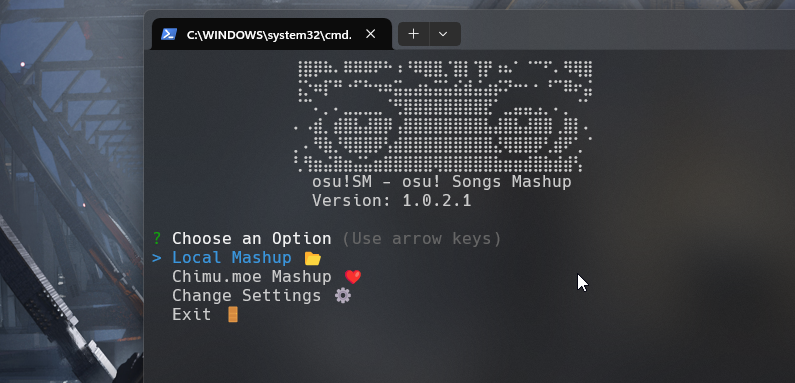

 

<h1>📖 osu! Songs Mashup </h1>

**"osu! Songs Mashup"** is a CLI tool that combines two beatmaps from the popular game osu! into a single harmonious experience, offering both offline and online compatibility, with such as Chimu.moe.

With its user-friendly filter functionality, you can create your mashups to match your skill level and musical tastes.

Make your osu! experience more intresting and give this tool a try!

## Installation

### For Windows:

1. Install any [Node.js](https://nodejs.org/en) version.
2. Install osu!SM from [latest releases](https://github.com/richardscull/Osu-Songs-Mashup/releases) (You can also just clone this repo)
3. Run `Start.bat` and enjoy!

### For Linux:

1. Install osu!SM from [latest releases](https://github.com/richardscull/Osu-Songs-Mashup/releases) (You can also just clone this repo)
2. Run `Start.sh` and enjoy!

##

<em> "Please enjoy game" —rrtyui </em>

